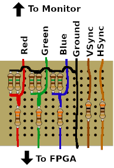

# fpga-vga-driver

A simple VGA driver using an old Altera Cyclone II EP2C5T144 FPGA. See it in action:

## VGA cable connector

The connector uses a simple voltage divider to convert the FPGA signal (3.3V) to the
VGA color signal full voltage (0.7V). I used two 150Ω resistors in parallel because
I didn't have a 75Ω available.

## FPGA code

The FPGA is used to generate the VGA signal and display a rectangle. The rectangle's position,
size and color can be controlled using the `spr_*` inputs (driven by the ESP32, see below).

The FPGA code is in Verilog. The top module is `vga_test`. Wires are:

wire          | direction | description
--------------|-----------|-------------
`clk`         | in        | 50MHz clock
`spr_clk`     | in        | data clock from ESP32
`spr_cmd`     | in        | command signal from ESP32
`spr_ser`     | in        | data from ESP32
`r`, `g`, `b` | out       | RGB color output
`h_sync`      | out       | VGA horizontal sync
`v_sync`      | out       | VGA vertical sync
`led`         | out       | on-board led output (for debugging)
`lcd`         | out       | 7-segment LCD of last command received (for debugging)

Serial data received in `spr_ser` is shifted (MSB first) into the command and parameter registers,
one bit every rising edge of `spr_clk`. The first 4 bits are shifted into the command register,
the following bits are shifted into the parameter register (up to 10 bits, depending on the
command). After the command and parameter are written, the command is executed when `spr_cmd`
goes high at the `spr_clk` rising edge.

The supported commands are:

command | parameter         | description
--------|-------------------|----------------------------------------------------------
  `0`   |                   | unused (reserved for selecting active sprite)
  `1`   | `[0:0] enable`    | enable or disable sprite
  `2`   | `[9:0] x_start`   | set start x coord of sprite
  `3`   | `[9:0] y_start`   | set start y coord of sprite
  `4`   | `[9:0] x_end`     | set end x coord of sprite
  `5`   | `[9:0] y_end`     | set end y coord of sprite
  `6`   | `[2:0] color`     | set color of sprite

## ESP32 code

The ESP32 code is a simple sketch to move the rectangle around, changing color every
time it hits the border of the screen.  I used an ESP32 simply because it outputs
3.3V, which is the voltage required for the the FPGA pins. An Arduino could easily be
used with a voltage level converter or just a simple voltage divider.
